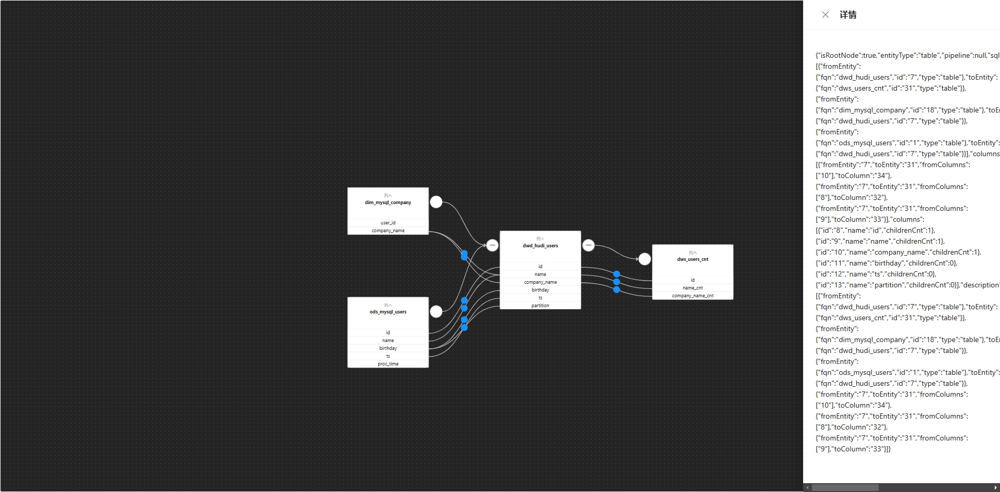

# React + Vite

This template provides a minimal setup to get React working in Vite with HMR and some ESLint rules.

Currently, two official plugins are available:

- [@vitejs/plugin-react](https://github.com/vitejs/vite-plugin-react/blob/main/packages/plugin-react/README.md) uses [Babel](https://babeljs.io/) for Fast Refresh
- [@vitejs/plugin-react-swc](https://github.com/vitejs/vite-plugin-react-swc) uses [SWC](https://swc.rs/) for Fast Refresh

> 只解析了血缘展示，交互分解中。

涉及技术：
[React](https://zh-hans.react.dev/reference/react)、
[Lodashjs](https://www.lodashjs.com/)、
[Dagrejs](https://github.com/dagrejs/dagre/wiki)、
[Graphlib](https://github.com/dagrejs/graphlib/wiki/API-Reference#graph-concepts)、
[ReactFlow](https://reactflow.dev/api-reference/react-flow)

[OpenMetaData](https://docs.open-metadata.org/latest/quick-start/sandbox) 解析的血缘呈现效果，结合了 [flink-sql-lineage](https://github.com/HamaWhiteGG/flink-sql-lineage) 血缘加工字段显示效果。

